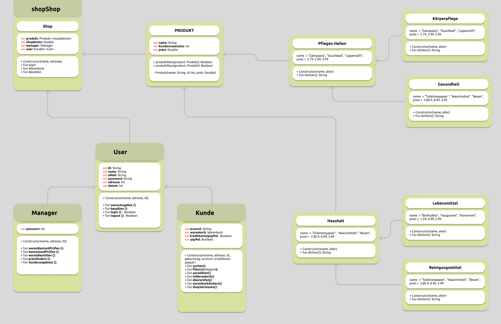

# M2 Abschlußarbeit Shop-System

Hier sind ein paar kurze Angaben, um das folgende Projekt zu verstehen:
Dieses README dient außerdem als Coding-Tagebuch.

---

 <b> Anlegen von Projektdaten  </b>

20230612 21:34
- erstelle Projekt
- erstelle Packages und Klassen
- speichere das Projekt auf GitHub, um eine zusätzliche Sicherung des Projektes zu haben
- Commit & Push auf Github Account GitteHeino
- erstelle ein klassendiagramm
-

**Package für die Aufgabe:** USER, Mitarbeiter, Waren …  
**fun main für den Code:** Main.kt

---

 <b> Aufgabe  </b>

**Modul für die Aufgabe:**  
**Datei für die Aufgabe:**

---

 <b> Aufgabe  </b>

**Modul für die Aufgabe:**
**Datei für die Aufgabe:**

---

 <b> Aufgabe n </b>

-
-

**Modul für die Aufgabe:**
**Datei für die Aufgabe:**

---

 <b> Aufgabe  </b>

<b> a) </b>

-
-
-
-

**Modul für die Aufgabe:**

**Datei für die Aufgabe:**

---

Projekt auf GitHub:
**https://github.com/GitteHeino/M2_Abschlussarbeit.git**

